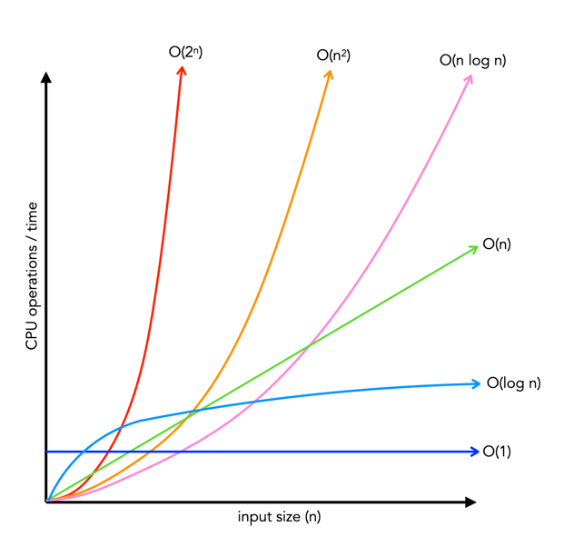

# Big O

**Is...How your alorithm will react as your input grows** :exploding_head:

**O(n)** means time/operations grows linearly with respect to the input.

## Important Concepts

1. Growth with respect to the input.
2. Constants are dropped.
3. Worst case is usually the way you measure.

O(n), easily stated, is a for/forEach loop, you iterate through each item in the list so the time for operation is dependent on units of input...there are no shortcuts or well educated guesses to attempt to shorten the process time.

O(2n) would be running two for loops one after the other. **NOT NESTED** (nested would be exponential). So two instances of O(n), but we always just refer to O(2n), O(3n), O(4n)... O(15n) as O(n) and drop the constant because constant growth is inconsequential performance wise compared to when exponential growth is implemented. _There are however, instances when O(n) gets so large that it should be reviewed and dealt with accordingly, but that is an exception rather than the rule._

## Other common complexities are...

- O(1) - Constant time - no matter how large the input is it does the same operations and is effectively instant.
  - ex. Anytime you access the known value of an array(const junk = numArray[3]) it is O[1] because you know exactly where to go.

- O(log n) - Base 2 log...relatively linear.

- O(n2) - Fast growth to avoid.

- O(2n)  and O(n!) - both take so long they are not practical/cannot be used with modern computers.

### Other algorithm examples

- O(n2) would be a loop with a nested loop.

- O(n3) would be a loop with a nested loop that also has a nested loop.

- O(n log n) - quicksort algorithm.

- O(log n) - binary serach trees algorithm.

[md documentation](https://docs.github.com/en/get-started/writing-on-github/getting-started-with-writing-and-formatting-on-github/basic-writing-and-formatting-syntax)
[emoji cheatsheet](https://github.com/ikatyang/emoji-cheat-sheet/blob/master/README.md)